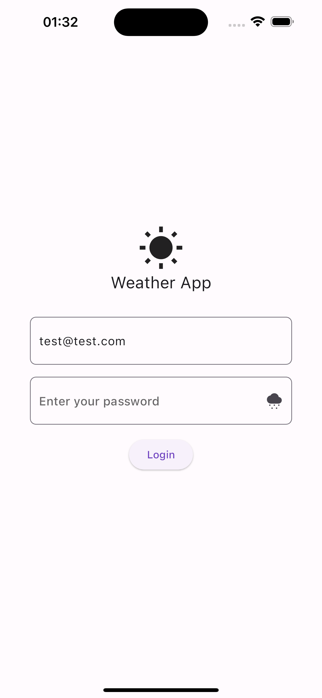
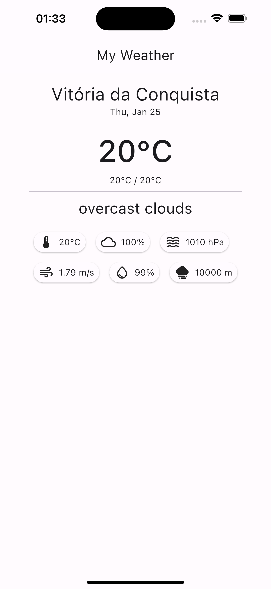
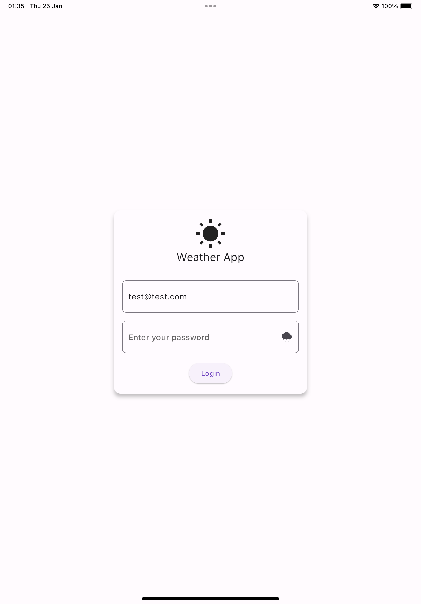
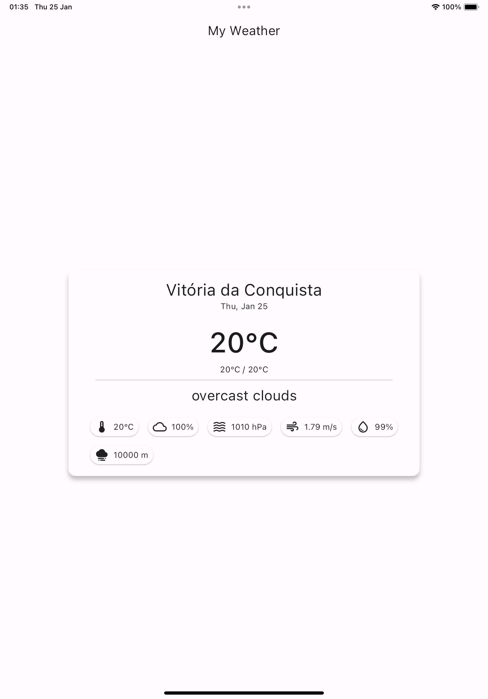
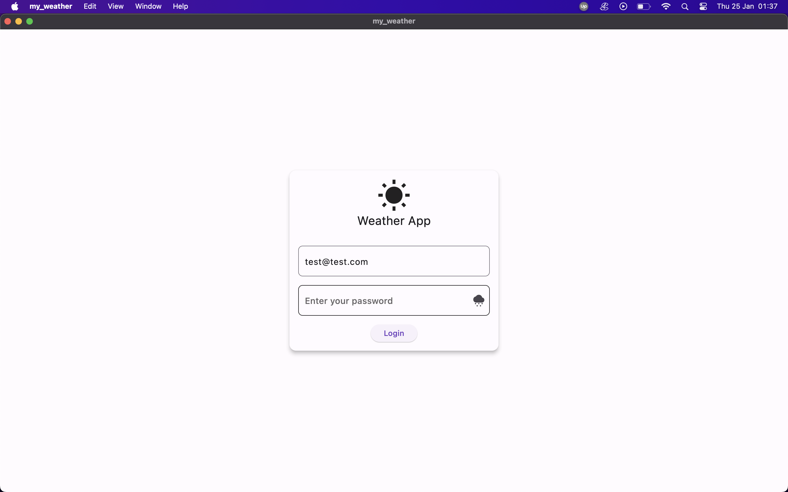
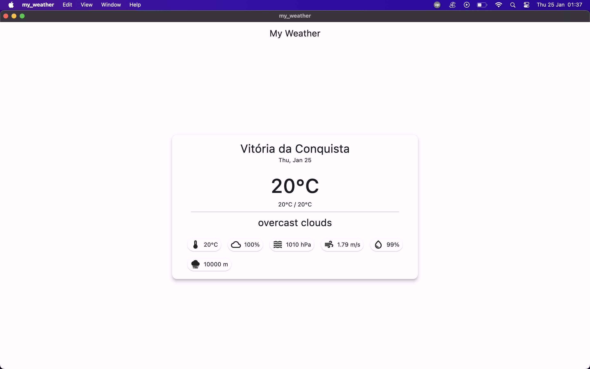

# My Weather

My Weather is a Flutter application that displays the weather in your current location.

## Screenshots

Here are some screenshots of the app on different devices:

### Smartphone



### Tablet



### Desktop



## Requirements

- Flutter 3.16.3 or later

## Getting Started

1. Visit the [Open Weather API](https://openweathermap.org/api) and sign up to get an API key.

2. Create a file named `env.json` in the root directory of the project. Add your API key to this file as follows:

    ```json
    {
      "OPEN_WEATHER_API_KEY": "YOUR_API_KEY"
    }
    ```

**note:** every command to run/build the app should include `--dart-define-from-file=env.dev` to apply the values from the `env.dev.json` file

## Running the app

1. Install the project dependencies by running the following command:
  
    ```bash
    flutter pub get
    ```

2. Generate the required files by running the following command:
  
    ```bash
    flutter pub run build_runner build --delete-conflicting-outputs
    ```

3. Run the app with the following command:
  
    ```bash
    flutter run --dart-define-from-file=env.dev.json
    ```